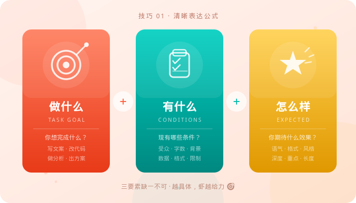
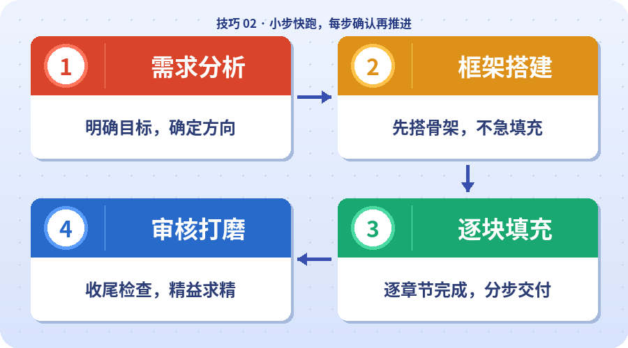
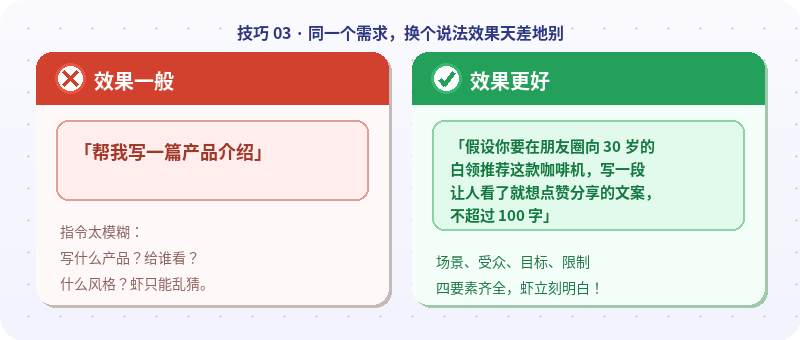
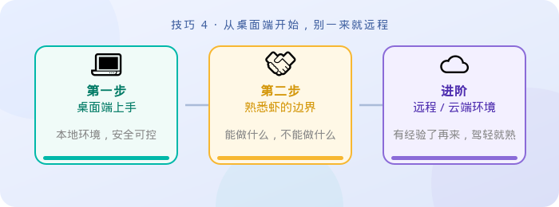
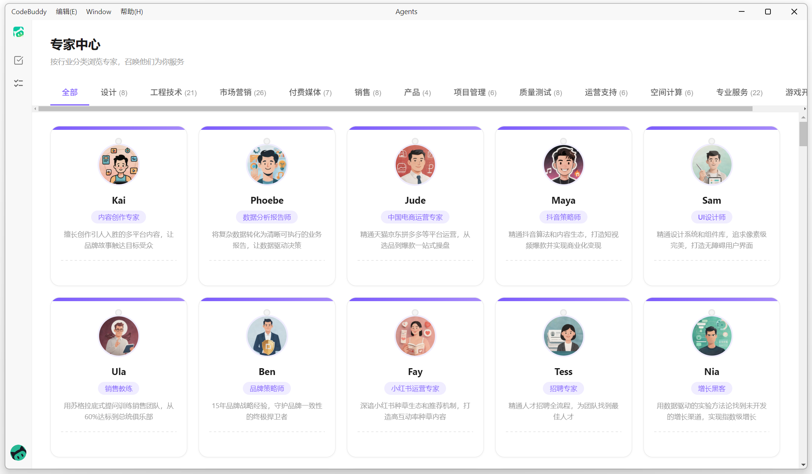
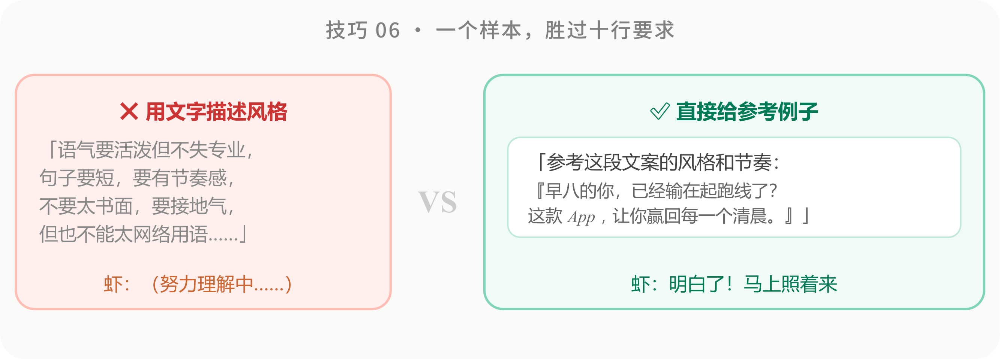
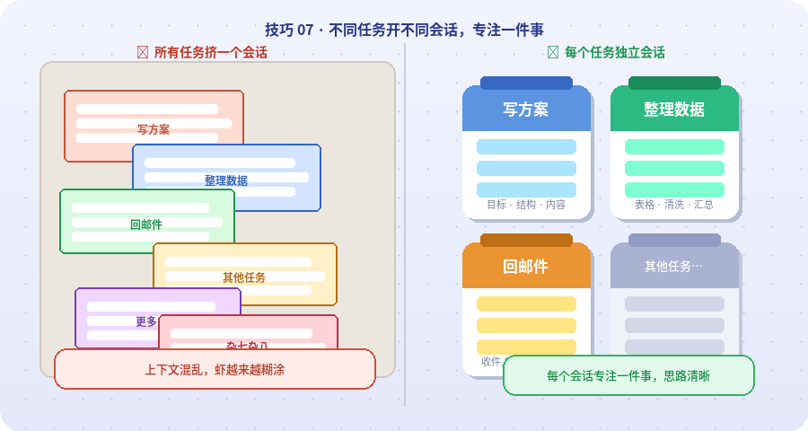
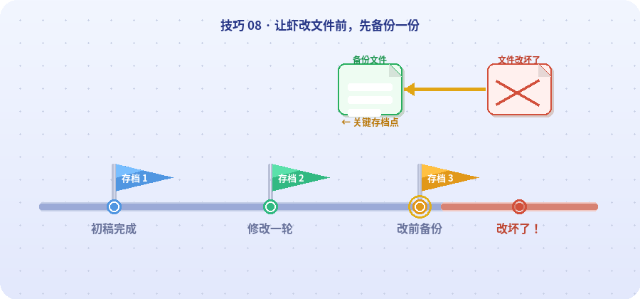
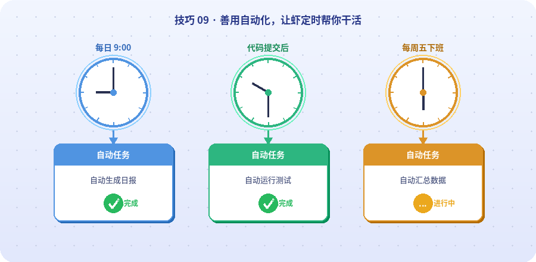

# 11 / 高效使用小技巧

如果你是第一次使用 WorkBuddy，不必一开始就研究所有高级能力。先把这 10 个高频技巧跑顺，就能更快把模糊想法变成可执行任务，也能减少“AI 输出很多，但不太能用”的情况。

## 说明

这一章适合三类读者：

- 第一次使用 WorkBuddy，还不确定应该怎么提问、怎么下任务；
- 已经开始使用，但结果不稳定，有时好用、有时跑偏；
- 希望把 WorkBuddy 放进真实工作，而不是只停留在简单问答。

可以把本章当作新手上手清单：它既讲如何描述任务，也讲如何控制风险、提高结果质量，以及什么时候适合交给 WorkBuddy 自动执行。

## 10 个上手技巧

### 1. 清晰表达，给 WorkBuddy 下达明确任务

不要只说“帮我整理一下”，而要把 **做什么、有什么、要什么结果** 讲清楚。信息越完整，WorkBuddy 越容易直接进入执行状态。

| 表达方式 | 示例 |
|-|-|
| 模糊需求 | 帮我把上次会议纪要整理一下 |
| 清晰需求 | 把 `D:/会议纪要/0320产品评审.docx` 整理成清单，包含议题结论、责任人、截止日期和未决事项，用表格输出，不需要开场白 |

如果不知道应该提供哪些信息，可以先问：`我想做 XX，你需要我提供哪些材料和约束？`

### 2. 小步快跑，一次只推进一件事

复杂任务不要一次塞满。先让 WorkBuddy 读资料、再确认结构、最后生成产物，每一步都留出检查点。

例如处理一份 50 页报告时，可以拆成三轮：

1. 先提炼 5 个核心结论，并标注原文页码；
2. 基于结论生成 15 页汇报大纲；
3. 确认大纲后，再展开其中某一页或某一节。

这样即使方向偏了，也能在中途拉回来，而不是最后推翻整份结果。

### 3. 不满意就调整，别一轮定生死

第一轮回答只是起点。发现不满意时，直接告诉 WorkBuddy 哪里不对、希望怎么改，比重新开一个模糊任务更有效。

常见调整方式包括：

- 指出具体问题：太长、太正式、第三段逻辑不通；
- 补充场景限制：受众、格式、语气、篇幅、时间范围；
- 切换角色视角：老板、客户、产品经理、分析师、法务；
- 给出修改目标：更像微信消息、更适合汇报、更适合执行。

### 4. 先本地后远程，稳扎稳打不踩坑

WorkBuddy 可以通过 IM 助理远程接收指令，但新手建议先在桌面端边看边用。等你理解它的执行方式、文件边界和确认机制后，再逐步尝试远程触发。

处理真实文件时，建议这样递进：

1. 先让 WorkBuddy 列出目标文件夹里的文件，不改动；
2. 再让它生成待移动或待修改清单，执行前确认；
3. 确认多次稳定后，再考虑远程或自动化。

### 5. 给 WorkBuddy 一个身份，它会更专业

面对专业任务时，可以使用 WorkBuddy 的“专家”能力，或在任务里明确角色。角色越贴近场景，输出框架和关注点越容易稳定。

例如：

- 写营销文案：让它以增长运营或品牌策划的身份思考；
- 做数据分析：让它以数据分析师身份输出指标、口径和结论；
- 看合同条款：让它以法务顾问身份标出风险点和待确认项。

### 6. 给 WorkBuddy 看例子，比写一堆抽象要求更管用

如果你想要某种语气、格式或版式，直接给一个参考样本。样本可以是旧报告、模板、截图、表格或一段你满意的文字。

一个好样本能同时传递结构、语气、详略、标题风格和格式要求。你只需要补一句：`请按这个结构和语气处理新的材料，不要照抄旧内容。`

### 7. 善用多任务，别在混乱上下文里死磕

不同任务尽量开不同会话。写方案、整理数据、处理邮件、生成 PPT 可以分开跑，避免一个长会话里混入太多背景。

如果某个会话已经很长，并开始出现前后矛盾、越聊越偏的情况，可以新建任务，把关键背景用 5-8 句话重新说清楚。很多时候，新上下文比反复修补旧上下文更省时间。

### 8. 频繁备份，给真实文件留退路

只要涉及真实文件修改，就先备份。WorkBuddy 很能干，但不代表每次都完全符合预期。备份可以很简单：复制一份原文件，或者在文件名后加日期与版本号。

推荐习惯：

- 原始文件保留不动；
- 让 WorkBuddy 在副本上操作；
- 大批量改动前先输出计划和影响清单；
- 改完后抽样检查，再决定是否替换主版本。

### 9. 用好自动化，让 WorkBuddy 持续干活

当一个任务重复性高、规则明确、输入来源稳定时，可以考虑设置为自动化任务，让 WorkBuddy 定时执行。

适合自动化的任务包括：

- 每天生成资讯早报；
- 每周汇总代码提交或项目进度；
- 定期整理文件夹和表格；
- 定时抓取并归纳行业动态；
- 固定格式生成日报、周报或复盘。

第一次做自动化前，建议先手动跑通 2-3 次，确认输入、输出和验收标准稳定。

### 10. 学会合理“偷懒”，把机械劳动交给 AI

“偷懒”不是降低质量，而是把重复、机械、标准化的部分交给 WorkBuddy，把你的精力留给判断、创意和决策。

适合交给 WorkBuddy 的工作包括：

- 格式化表格、统一字段、批量改名；
- 把素材整理成固定模板；
- 生成初稿、标题、摘要和检查清单；
- 根据既有样本扩写、改写或重排内容。

如果想提高输出质量，可以给它更明确的角色和质量标准。例如：`你是一位有 10 年经验的财务分析师，请按投资研究报告的标准分析这份财报。结论要明确，假设要标注，风险要单独列出。`

## 推荐上手顺序

刚开始使用 WorkBuddy 时，建议按下面的顺序建立习惯：

1. 先学会清晰提需求，把任务说完整；
2. 再学会分步推进和多轮调整，不追求第一轮完美；
3. 随后使用专家、样例和多任务能力，提高稳定性；
4. 涉及真实文件时先备份，再尝试远程和自动化；
5. 等流程稳定后，再把重复任务沉淀成模板、Skill 或自动化任务。

先把这 10 个技巧变成肌肉记忆，后面无论写文档、做分析、处理表格，还是搭建自动化流程，都会顺手很多。
