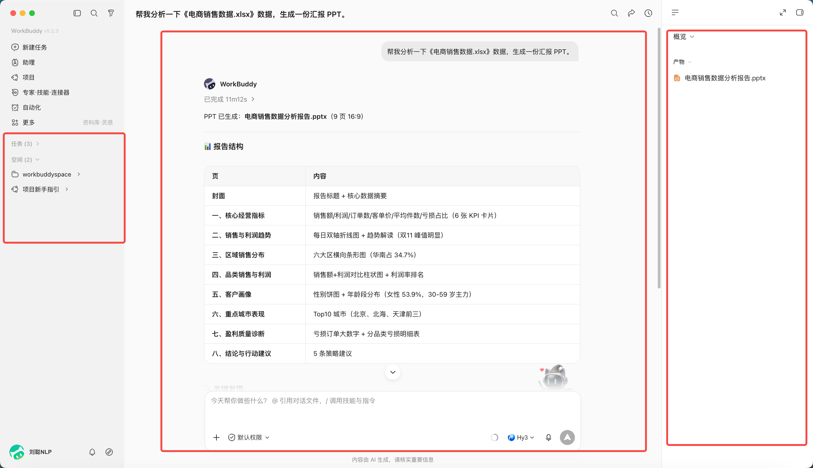
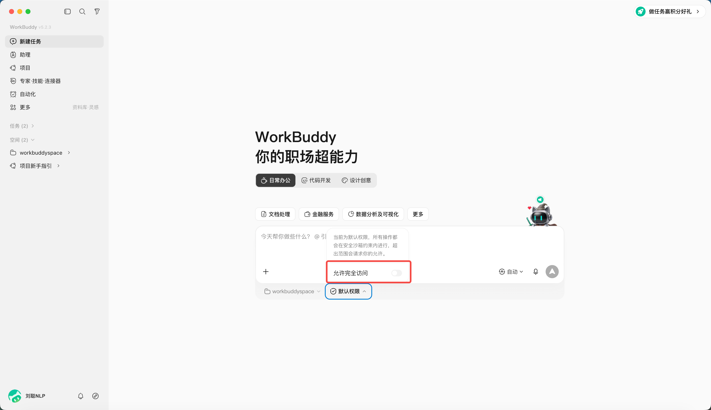
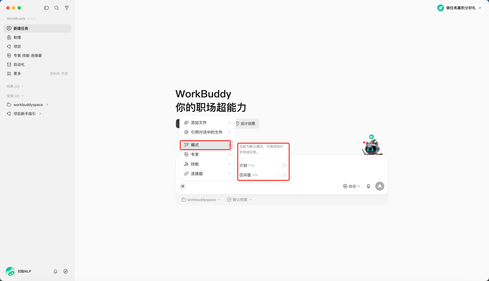
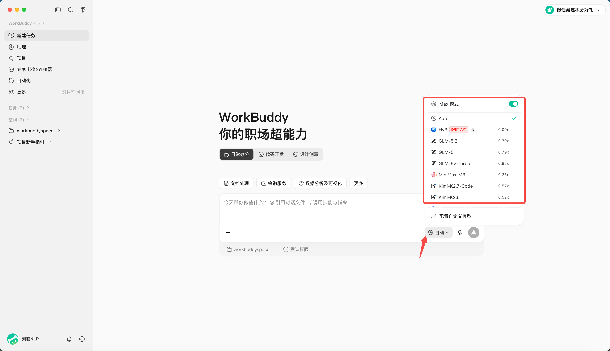

# 03 / 主界面、任务与工作区

WorkBuddy 主界面可以理解为三个区域：左侧（侧边栏）管理任务，中间（对话区）下达和追踪任务，右侧（结果区）查看文件、变更、预览和最终产物。

## 三个区域分别做什么

| 区域 | 主要用途 | 使用时重点检查 |
|-|-|-|
| 侧边栏 | 新建、搜索、切换和管理任务 | 是否进入了正确任务 |
| 对话区 | 描述需求、补充信息、确认计划 | 目标和约束是否完整 |
| 结果区 | 查看产物、全部文件、变更与预览 | 文件名、路径和改动是否符合预期 |

侧边栏的“任务”和“工作空间”的区别，在于你是否设置了“工作空间”目录。

“工作空间”是 WorkBuddy 为了管理任务而设置的目录，每个任务都有一个对应的目录空间，任务可以在目录空间内进行操作。

若未设置，会在默认安装的目录下执行任务，对话保存在“任务”目录下。

## 为什么要隔离工作目录

工作目录既是效率设置，也是安全边界。把发票、周报、客户材料混在同一个大目录里，会增加误读、误改和信息串用的风险。

推荐按任务建目录空间。

同时，可以对目录空间的权限进行设置，当开启“允许完全访问”（开启完全访问后智能体可读写授权目录外文件，请谨慎使用并优先按任务限定目录。）

## 三种工作模式

WorkBuddy 提供三种工作模式：

| 模式 | 中文界面 | 能做什么 | 适合场景 |
|-|-|-|-|
| Ask | 问一问 | 问答、理解和查看，不修改文件 | 先了解资料、确认需求 |
| Craft | 做一做 | 可直接操作本地文件、运行代码及系统指令 | 路径清楚、风险较低的任务 |
| Plan | 想一想 | 先生成计划，确认后再执行 | 多步骤、跨系统、重要文件任务 |

## 选择不同的模型

默认为自动模式，可以指定你想使用的模型，不同模型积分消耗不同。

| 模型 | 简要介绍 | 主要功能 |
|-|-|-|
| Auto | 由 WorkBuddy 根据任务自动选择模型 | 适合大多数日常任务，不需要手动判断模型能力和成本 |
| Hyb3 | 通用办公模型，适合中文办公与综合任务 | 文档理解、资料整理、总结改写、普通问答和多步骤办公任务 |
| GLM-5.2 | 综合能力较强的通用模型 | 复杂分析、长文本处理、方案撰写、结构化输出和多轮推理 |
| GLM-5.1 | 稳定型通用模型 | 常规写作、信息整理、表格口径梳理和低风险办公任务 |
| GLM-5v-Turbo | 带视觉理解能力的模型 | 截图识别、界面理解、图片内容说明、图文混合任务 |
| MiniMax-M3 | 成本较低、响应较轻的模型 | 高频简单问答、短文本改写、轻量分类和快速草稿 |
| Kimi-K2.7-Code | 偏代码与技术任务的模型 | 代码解释、脚本生成、技术文档、错误日志分析和工程类任务 |
| Kimi-K2.6 | 长文本与资料阅读友好的模型 | 长资料阅读、会议纪要、材料归纳、跨文档信息提取 |

| 任务场景 | 推荐模型 | 选择理由 |
|-|-|-|
| 不确定该选哪个模型 | Auto | 让系统先自动判断，适合新手和普通办公任务 |
| 写周报、改文案、整理资料 | Hyb3 / GLM-5.1 | 中文办公场景稳定，成本和效果比较均衡 |
| 分析复杂材料、输出方案或报告 | GLM-5.2 | 更适合多步骤推理、结构化分析和高质量成稿 |
| 处理截图、界面图片或图文资料 | GLM-5v-Turbo | 需要模型先看懂图片内容，再进行解释或整理 |
| 批量做简单分类、摘要或格式转换 | MiniMax-M3 | 轻量任务优先考虑速度和积分消耗 |
| 写代码、看报错、分析技术日志 | Kimi-K2.7-Code | 更适合代码开发、技术排查和脚本类任务 |
| 阅读长篇文档、合同、研究资料 | Kimi-K2.6 / GLM-5.2 | 更适合长文本理解、跨段落归纳和重点提取 |

模型列表和积分倍率会随 WorkBuddy 版本变化。实际使用时，可以先用 Auto；遇到图片、代码、长文档或复杂分析任务时，再按场景手动切换模型。
