# 第 8 章 WorkBuddy 接入小程序与 IM 助理

## 小程序的两种模式

| 模式 | 任务在哪里运行 | 是否依赖电脑在线 | 适合任务 |
|-|-|-|-|
| 本机模式 | 已连接的电脑 | 是 | 本地文件、本地 Skill、已有工作区 |
| 云端模式 | 隔离的云端环境 | 否 | 调研、写作、临时分析、并行任务 |

**首次使用**

1. 通过官方入口打开 WorkBuddy 小程序并登录；
2. 查看当前处于本机还是云端模式；
3. 本机模式下确认目标电脑在线且连接正确；

## IM 助理的工作链路

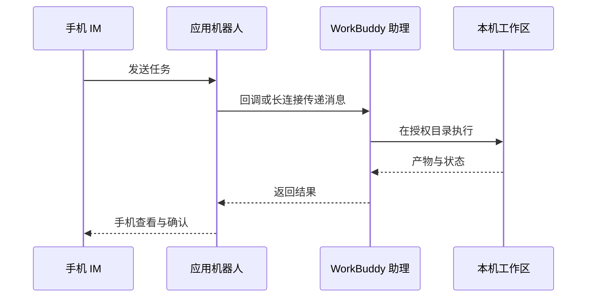

## 接入微信助理：扫码绑定即可

1. 打开 WorkBuddy，在左侧“助理”栏点击齿轮，进入“助理设置”；

2. 找到“微信助理集成”，点击“配置”；

3. 等待绑定二维码生成，用手机微信扫码；

4. 卡片显示“已绑定”后，先发送一条只读测试指令；

5. 需要切换微信账号时，先解绑当前账号，再重新扫码。

二维码有时效限制。停留在“绑定中”、二维码过期或扫码失败时，关闭配置窗口后重新进入，必要时重启 WorkBuddy 并重新生成二维码。

***来源：WorkBuddy 官方指南。***

## 接入企微

企微助理适合把 WorkBuddy 放进团队日常协作场景：在企业微信群里 @机器人 下发任务、查看进度、确认高风险操作，并把任务结果同步回群聊。它的本质是让企业微信负责接收指令与消息通知，真正的任务执行仍然发生在你的电脑和 WorkBuddy 工作区中。

| 准备项 | 说明 |
|-|-|
| WorkBuddy 桌面端 | 建议使用 4.6.4 或更新版本，并保持运行中 |
| 企业微信账号 | 管理员可在管理后台创建机器人，普通成员可在客户端工作台创建 |
| 网络与电脑状态 | 电脑和手机都需要联网，远程任务期间电脑不能关机 |
| 接入方式 | 优先选择 WebSocket 长连接；URL 回调作为备选方案 |

### 管理员创建企微机器人

1. 使用管理员账号进入企业微信管理后台，按「安全与管理」→「管理工具」→「智能机器人」→「创建机器人」进入创建流程；

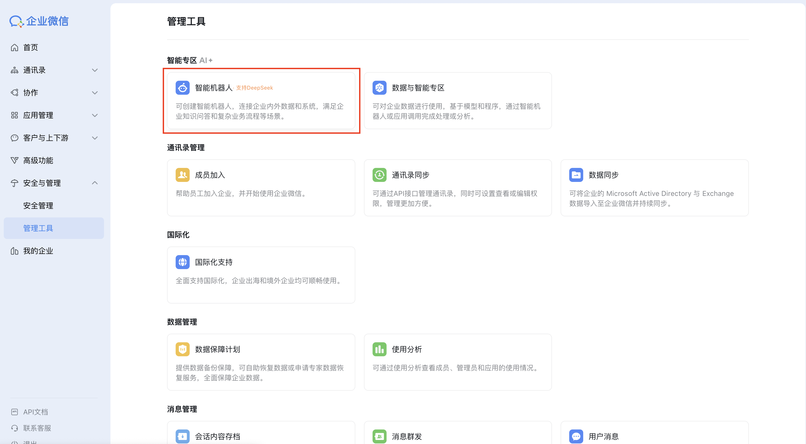

2. 如果页面先进入 AI 自动生成机器人流程，点击左下角「手动创建」；

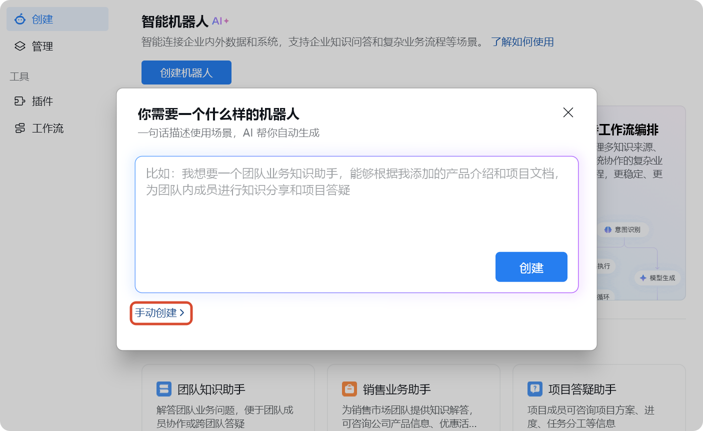

3. 在创建方式里选择「API 模式创建」；

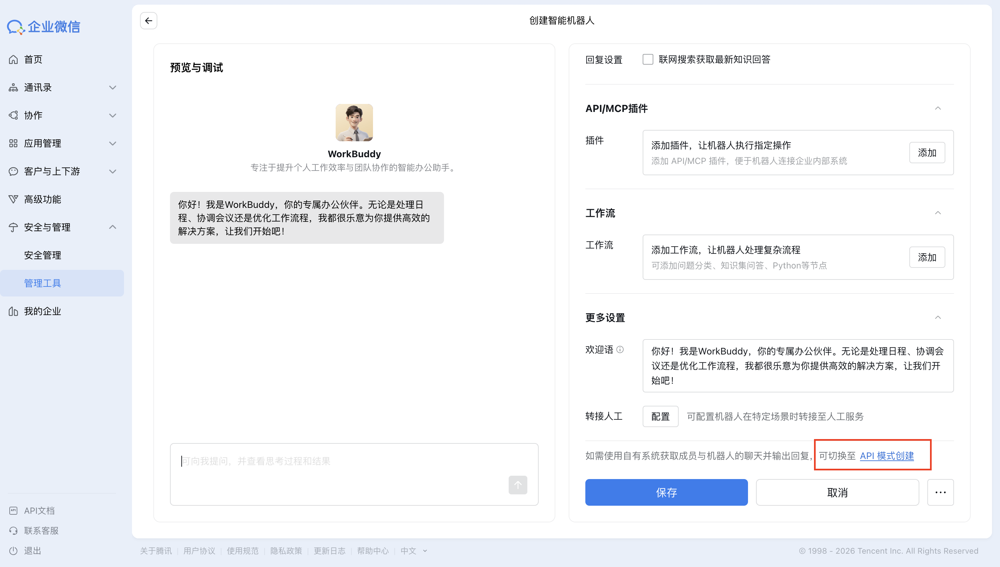

4. 填写机器人名称，并通过「可见范围」选择可以使用机器人的成员、部门或标签；

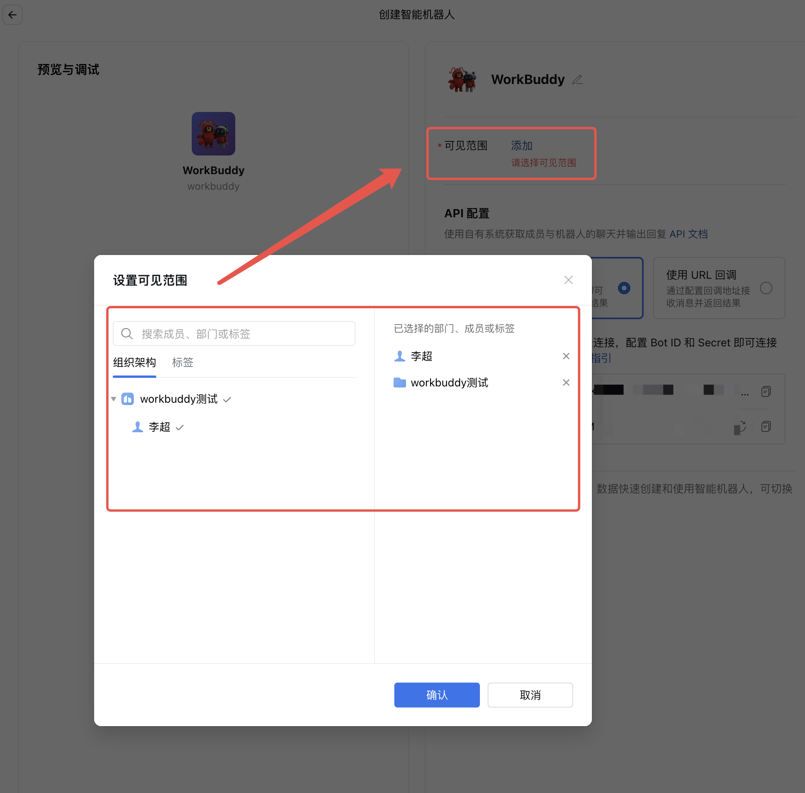

5. 完成基础信息后先保存，再到右侧「API 配置」区域选择「使用长连接」。

### 普通成员创建企微机器人

1. 打开企业微信客户端，进入「工作台」→「智能机器人应用」→「创建机器人」；

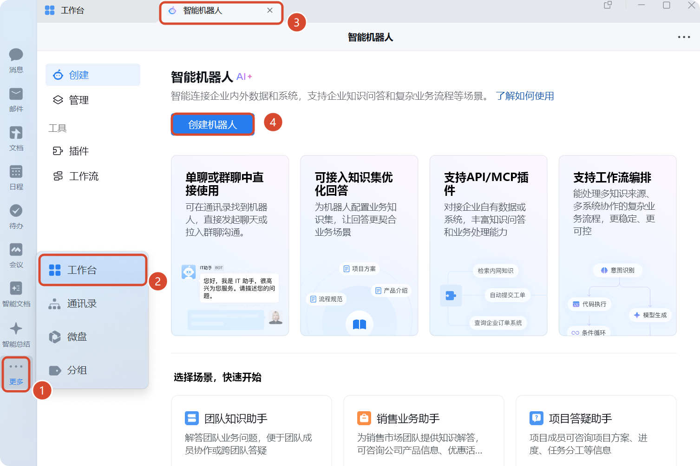

2. 如果先进入 AI 自动生成页面，同样选择「手动创建」，再进入「API 模式创建」；

3. 填写机器人名称，并在「可使用成员」里选择允许使用该机器人的成员或范围；

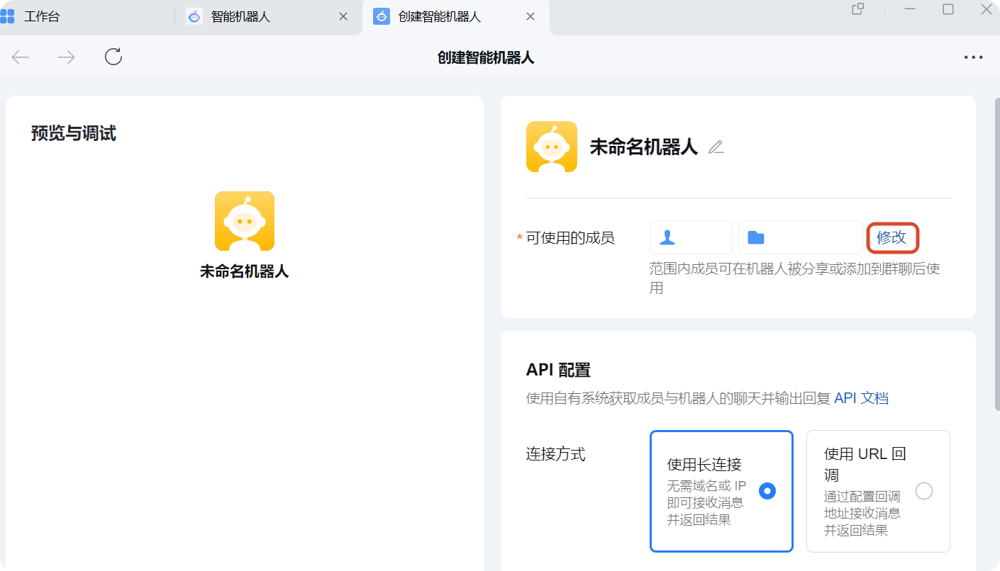

4. 完成基础信息后，在下方「API 配置」区域选择「使用长连接」。

### 使用长连接完成绑定

长连接是更适合快速上手的接入方式：不需要回填 Webhook URL，也不需要额外配置 Token 或 Encoding-AESKey。

1. 在企微机器人的「API 配置」区域选择「使用长连接」；
2. 复制 `Bot ID`；
3. 点击「点击获取」拿到 `Secret`，并妥善保存；

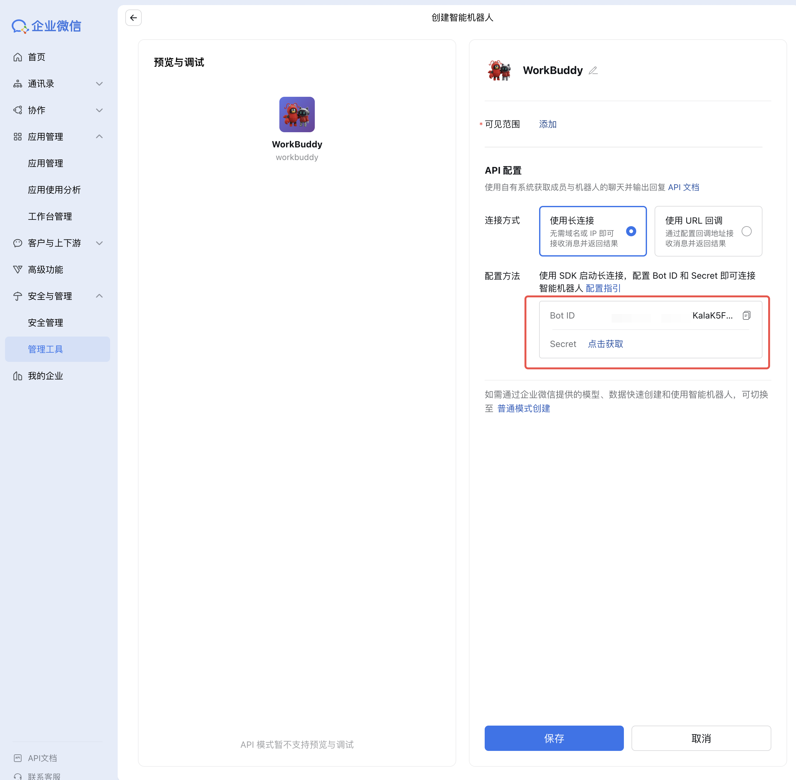

4. 回到 WorkBuddy，进入「设置」→「助理设置」；
5. 在「集成」区域找到企微助理集成，点击「配置」；
6. 选择「WebSocket 长连接」，填写 `Bot ID` 和 `Secret` 后点击「注册」；

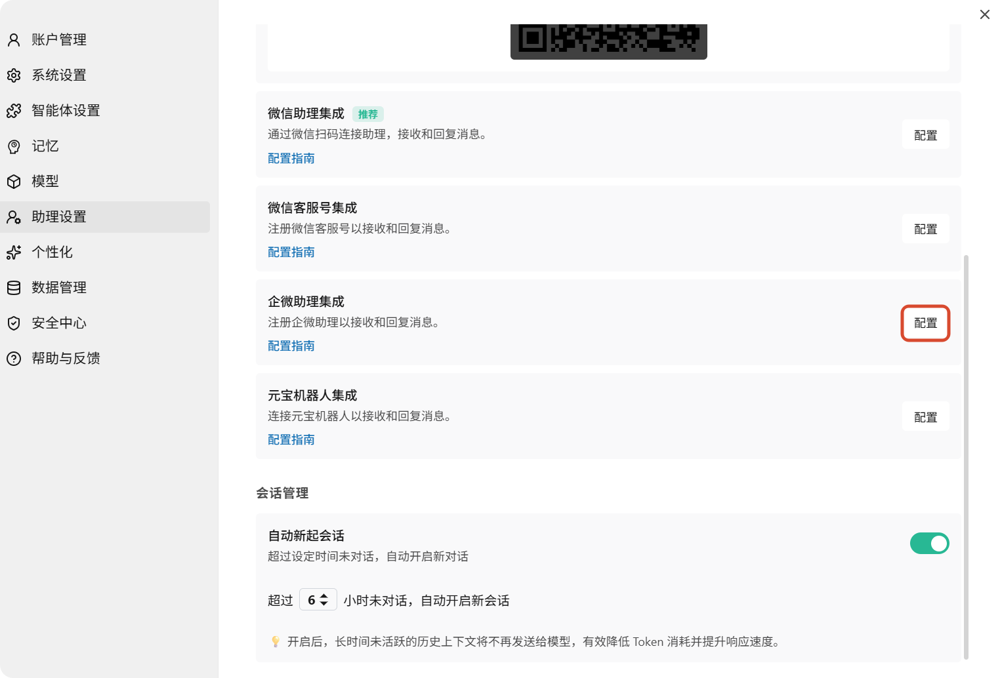

7. 注册成功后，在企业微信通讯录的「企业创建的」分组中找到机器人，点击「发消息」；

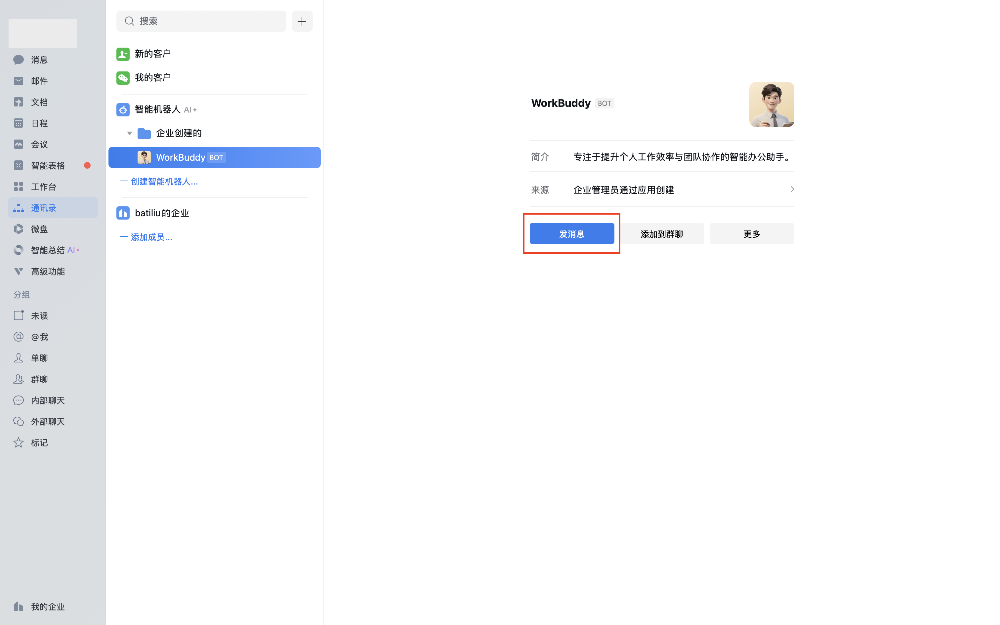

8. 发送一条简单消息测试联通。如果机器人能正常回复，就说明 WorkBuddy 与企业微信已经完成对接。

### 远程任务怎么理解

企微助理并不是把 WorkBuddy 搬到云端，而是让企业微信成为远程入口。企业微信负责发送指令、接收结果和确认操作；你的电脑负责调用本地文件、Shell 环境、插件、凭证和已授权工具。

| 对比项 | 普通任务 | 企微助理任务 |
|-|-|-|
| 入口 | WorkBuddy 主界面 | 企业微信聊天窗口 |
| 工作目录 | 可按任务自由指定 | 使用助理专属任务空间 |
| 会话管理 | 可以新建多个任务 | 远程指令集中在助理会话里 |
| 适合场景 | 本地深度操作 | 远程触发、群内协作、进度通知 |

重要文件、批量修改和需要人工判断的任务，建议先在电脑端普通任务里验证流程；确认稳定后，再放到企微助理里远程触发。

### URL 回调接入：备选方案

如果企业网络或已有系统要求使用 Webhook 回调，可以改用 URL 回调模式。

1. 在企业微信「API 配置」区域选择「使用 URL 回调」；
2. 随机生成并保存 `Token` 和 `Encoding-AESKey`；

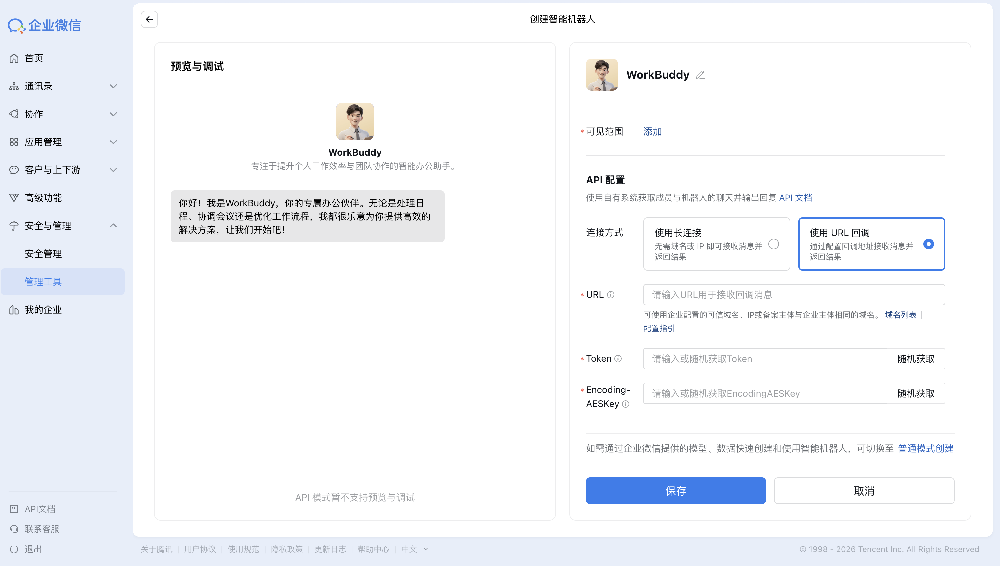

3. 回到 WorkBuddy 的企微助理配置弹窗，切换到「使用 URL 回调」；
4. 填入 `Token` 和 `Encoding-AESKey`，点击「注册」；

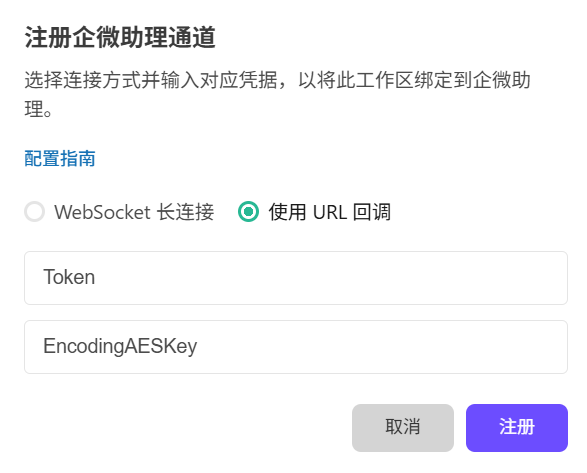

5. 注册成功后复制 WorkBuddy 生成的 Webhook URL；

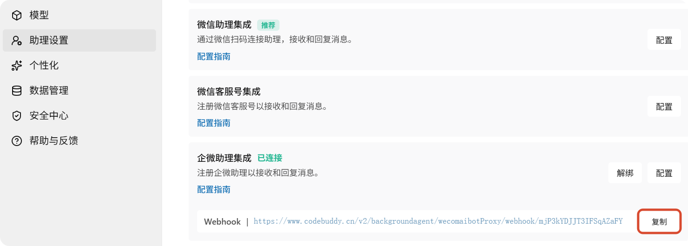

6. 回到企业微信机器人创建页面，将 Webhook URL 回填到 `URL` 输入框并保存。

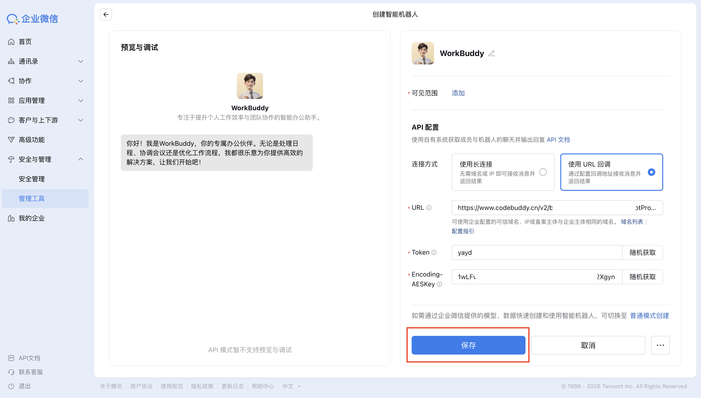

### 常见排查

| 问题 | 重点检查 |
|-|-|
| 机器人没有响应 | WorkBuddy 是否正在运行，助理服务是否开启，企微和 WorkBuddy 是否选择了同一种接入方式 |
| 长连接注册失败 | `Bot ID` 和 `Secret` 是否复制完整，是否带入多余空格，`Secret` 是否已失效 |
| URL 验证失败 | Webhook URL 是否复制完整，`Token` 和 `Encoding-AESKey` 是否与 WorkBuddy 中填写的一致 |
| 任务执行异常 | 电脑是否在线，目标文件是否在授权目录内，是否需要在 WorkBuddy 侧确认高风险操作 |

## 接入飞书

1. WorkBuddy → 设置 → 助理设置 → 选择飞书；

2. 在飞书开放平台创建企业自建应用；

3. 为应用添加机器人能力；

4. 按 WorkBuddy 当前页面要求开通最小权限；

5. 在“凭证与基础信息”获取 App ID 和 App Secret；

6. 将凭证填写到 WorkBuddy，生成或复制回调信息；

7. 在飞书配置事件订阅与回调；

8. 添加接收消息、卡片交互等当前指南要求的事件；

9. 创建版本并发布应用；

10. 在飞书内向机器人发送只读测试任务。

***来源：WorkBuddy 官方指南。***

## 接入钉钉

1. 创建应用与机器人使用企业管理员账号登录钉钉开发者后台；

2. 进入“应用开发”，创建应用；

3. 为应用添加机器人能力，填写机器人名称、描述和头像并确认发布；

4. 优先在测试组织或测试群完成验证。

***来源：WorkBuddy 官方指南。***
